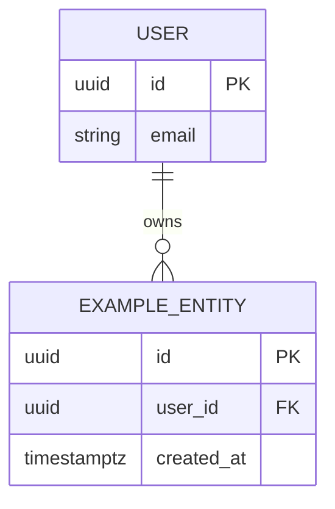

# Foundational Architecture Bet

> The platform's load-bearing technical decisions, as a wager.

## Context

<Constraints — regulatory, team skill, performance, cost — that shape this architecture.>

## Fitness Functions

The measurable architectural targets this bet must satisfy. **≥1 per Well-Architected pillar (6 minimum), each in numbers — not adjectives.** Empty rows fail verification. These are the bet's falsification criteria.

| Pillar | Function (measurable) | Threshold | Source / rationale |
|--------|-----------------------|-----------|--------------------|
| Reliability | <e.g., monthly uptime; RPO; RTO> | <e.g., 99.9% / 5 min / 30 min> | <derived from product bet guardrail / SLO> |
| Security | <e.g., compliance posture; auth model> | <e.g., SOC 2 Type II by Q4> | <derived from product bet user segment / regulatory> |
| Performance efficiency | <e.g., p95 API latency; concurrent users> | <e.g., < 200ms; 3k concurrent at peak> | <derived from north-star metric / scale forecast> |
| Cost optimization | <e.g., cost per active user / month> | <e.g., < $0.40> | <derived from unit economics in product bet> |
| Operational excellence | <e.g., deploy frequency; MTTR> | <e.g., daily; < 30 min> | <derived from team size + iteration velocity> |
| Sustainability | <e.g., hosting-region constraint; carbon-per-request budget — or "not load-bearing at current stage"> | <threshold or "n/a — revisit at scale X"> | <honest assessment> |

## Decision

<One clear paragraph: the architectural posture chosen. A reader should know what we're building from this section alone.>

## Foundational Data Model

Conventions every bet inherits. Decided **before** the DB choice — DB row in the Stack table must cite this section. Empty subsections, "TBD" answers, or invented entities fail verification.

### Core entities

Each entity traces back to a line in `docs/foundation/product.md`. Don't invent entities the product bet doesn't imply.

| Entity | Purpose | Traces back to (product bet line / quote) |
|--------|---------|-------------------------------------------|
| <e.g., User> | <auth + identity holder> | <e.g., "target users: senior developers" — product.md L23> |
| | | |
| | | |

### Identity strategy

<UUID v7 / ULID / sequential / external IDs — with rationale. Note implications for indexing, sortability, and external sharing.>

### Tenancy model

<single-tenant / pooled / siloed / hybrid — derived from product bet personas and defensibility moats. Name the rationale explicitly.>

### Audit / event-sourcing posture

<full event log / change-data-capture / created-updated only — derived from compliance posture and defensibility moats (data-as-moat → audit is stronger).>

### Delete posture

<soft vs hard; scope (which entities are soft-deletable, which are immutable). Retention windows where applicable.>

### PII / sensitive-data handling

<What counts as PII for this product. Encryption at rest. Retention windows. Links to the Security pillar in the Fitness Functions table above.>

### Timestamps convention

<UTC; `created_at` / `updated_at` columns; `deleted_at` if soft-delete; timezone handling.>

### Migration strategy

<online / offline / blue-green / expand-contract — derived from Reliability and Operational excellence fitness functions.>

### High-level ERD

<Replace the example. Show all core entities with key relationships and cardinality (one-to-many, many-to-many).>

## Stack

Every row scored on all 6 Well-Architected pillars in the per-row evaluations below. Empty pillar cells fail verification. Reversibility is honest (evidence-backed via the "Reversibility honesty" research category).

**The Database row must cite the Foundational Data Model section above** — DB choice that ignores entity shape, identity strategy, tenancy, and audit posture is the decide-before-derive anti-pattern and fails verification.

| Concern | Choice | Reversibility |
|---------|--------|---------------|
| Repo shape | monorepo / polyrepo | <hard / one-way> |
| Backend language | <language> | <hard> |
| Backend framework | <framework> | <medium> |
| Frontend framework | <framework> | <medium> |
| Mobile framework | <framework> | <medium> |
| Database | <DB> | <hard> |
| Contracts format | <OpenAPI / tRPC / GraphQL / none> | <medium> |
| Auth model | <session / JWT / OAuth> | <hard> |
| Deployment target | <cloud / on-prem> | <one-way> |
| CI/CD platform | <GH Actions / GitLab CI / etc.> | <medium> |
| Observability | <Sentry / Datadog / etc.> | <medium> |
| Secrets management | <Vault / AWS Secrets / etc.> | <hard> |
| Infrastructure-as-code | <Terraform / Pulumi / etc.> | <medium> |

### Per-row pillar evaluation + research citations

For each stack row above, fill the block below. Copy-paste for every concern; empty rows or "smart default" justifications fail verification.

#### <Concern>: <Choice>

| Pillar | Score (good / acceptable / poor) | Rationale | Research citation |
|--------|----------------------------------|-----------|-------------------|
| Reliability |  |  |  |
| Security |  |  |  |
| Performance efficiency |  |  |  |
| Cost optimization |  |  |  |
| Operational excellence |  |  |  |
| Sustainability |  |  |  |

## Boundaries (initial)

<Directory structure / service split / module boundaries that all bets start from.>

## Cross-cutting standards

- Logging:
- Error handling:
- Naming:
- Testing:
- Observability:

## Hypothesis (the bet)

<This stack and these standards will support <product vision> for <N years> with <team size>. Specifically: <falsifiable hypothesis>.>

## Guardrail metrics

What must NOT degrade for this architecture to count as won:
- <metric>: stays above/below <threshold> (e.g., dev velocity, cost-per-user, MTTR)

## Alternatives considered

Evaluated against the declared fitness functions and pillars — **not generic pros / cons, not strawmen.** At least one real alternative per major stack choice.

| Option | Fitness-function fit | Pillar tradeoffs | Why rejected |
|--------|----------------------|------------------|--------------|
| Chosen | <which functions it satisfies / barely meets / exceeds> | <which pillars it favors / hurts> | — |
| Alt A | | | <which specific fitness function(s) it fails> |
| Alt B | | | <which specific fitness function(s) it fails> |

## Architecture Research

Findings from the 6-category architecture-research framework (see `compass/roles/enterprise-architect.md` → "Where to research"). For substantial research, move to `docs/foundation/architecture-research.md` and link here.

### 1. Prior art
<Comparable companies, their workload, the stack they ended up at, link to source.>

### 2. Benchmarks
<Numbers under workloads close to ours, with link + methodology note.>

### 3. Vendor health
<Hireability, release cadence, license posture, vendor stability.>

### 4. Failure modes
<Post-mortems where the stack choice was load-bearing in the failure.>

### 5. Pillar fit
<Per-pillar evaluation of candidates, cited.>

### 6. Reversibility honesty
<Evidence-backed lock-in assessment per major choice — migration case studies, export tooling, exit costs.>

## Consequences

**Positive:**
-

**Negative:**
-

**Lock-in:**
- <Specific things that are now hard to change>

## Repo scaffolding completed

- [ ] Boundary folders created
- [ ] CI/CD pipeline files in place
- [ ] Base configs (tsconfig, eslint, etc.)
- [ ] `compass/config.yaml` populated with team decisions
- [ ] `docs/playbooks/` directory created (with a `README.md` pointing at `compass/templates/playbook.md`). Stays empty until the team has stack-specific learnings worth capturing — populated lazily via `/measure` soft prompts when bets resolve with notable technical learnings. Future Architects consult this directory as **signal-consultation category 5** in `/setup-foundation-architecture` step 6.

## ADR / Amendments

Architecture Decision Record. **Required to have ≥1 entry for any version > 1** (every amendment writes one entry). The foundational architecture IS the ADR ledger — no separate ADR file convention.

Each entry uses the shape below. ADR numbers are sequential and never reused (even if an ADR is later superseded — supersession is noted in a new ADR).

### ADR-001 — <Short title> (YYYY-MM-DD)

**Triggered by:** <bet ID + reason, OR foundational research finding, OR ops incident, OR external mandate>. Most commonly: a bet hit the deviation gate in `/create-bet-architecture` and needs new tooling in the foundational stack.

**What changed:** <Specific changes to the foundational doc — Stack table entries added/modified, fitness functions updated, data-model conventions amended, boundaries shifted. Be concrete: "Stack table gained `Cache layer: Redis`. Fitness function for cost-per-user adjusted +$0.02/MAU to absorb Redis infra cost.">

**Why:** <Decision rationale. Cite the foundational fitness function pressured (e.g., "Profile endpoint p95 350ms exceeds <200ms fitness function"). Cite the alternatives evaluated and why rejected.>

**Reversibility:** <easy | medium | hard | one-way> + concrete migration / exit path. If `hard` or `one-way`, name the operational handle that would force a future amendment.

**Cited signal:** <Specific sources consulted: observability MCP links, prior PR numbers, bet architecture doc paths, foundational fitness function table version. The 4 signal-consultation categories in `setup-foundation-architecture.md` step 6 are the canonical sources.>

---

### ADR-002 — <Next amendment> (YYYY-MM-DD)

<...>

## Check-in log

_Populated automatically by `/measure` cron._

## DRI Log

### Decisions
- [YYYY-MM-DD] [Enterprise Architect] <decision> — rationale: <why> — area: <tag> — alternatives: <what> — reversibility: <hard / one-way>

### Risks
- [YYYY-MM-DD] [Enterprise Architect] <risk> — likelihood — impact — mitigation — area

### Issues
- [YYYY-MM-DD] [Enterprise Architect] <issue> — severity — owner — status — area

---

_Approved by: <name> on <date>_
