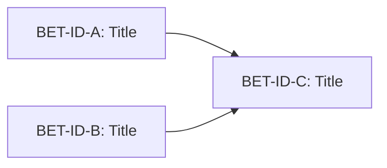

# MVP Bet Portfolio

> The initial bet wedge — what we build together so one real user can complete the core value loop once. Bootstrap-only: created once per project, after foundation product + architecture are approved.

## MVP definition

> _Verbatim user answer to the forcing question:_ **"What does this product need to do for one real user to complete the core value loop once?"**

<Paste the user's answer here, unedited. This is the load-bearing scope statement — every MVP bet below traces back to enabling some part of this loop.>

## MVP bets

Bets that together enable the loop above. Each must be independently shippable OR clearly sequenced. Each stub brief lives at `docs/bets/<bet-id>/brief.md` with `portfolio_stub: true` until promoted via `/create-brief <bet-id>`.

| Bet ID | Title | One-line hypothesis | Type | Depends on | Parallel with |
|--------|-------|---------------------|------|------------|---------------|
| <BET-ID> | <Title> | <If we ship X, then Y user can do Z — traces to product.md L<N>> | feature / okr / tech-debt / etc. | [<other-bet-ids> or none] | [<other-bet-ids> or none] |
|  |  |  |  |  |  |
|  |  |  |  |  |  |

## Dependency graph

<Replace example. Show every MVP bet as a node; edges = "depends on". If everything is parallel, declare it: "No dependencies — all bets parallel.">

## Parallel-build candidates

Independent paths that can start in parallel after the portfolio is approved:

- **Stream 1:** <BET-ID-A>, <BET-ID-B> — no dependencies, can run together from day 1
- **Stream 2:** <BET-ID-C> — depends on Stream 1 completion
- ...

## Deliberately out of MVP

Captured here so we don't lose them, **but no stub briefs created**. These come back as `/create-brief <free-text>` after the MVP ships and learnings settle. If this section is empty, MVP scope is probably padded — log as a DRI Risk.

- **<Item>** — <one-line rationale for why it can wait>
- **<Item>** — <rationale>
- **<Item>** — <rationale>

## PM rationale

<Why this wedge, why this MVP line, why these are the right bets to start in parallel. 2-3 sentences. The "why this wedge" answer is the thing future-you will check against when scope-creep pressure arrives.>

## Promotion log

_Populated as each stub gets promoted to a full brief via `/create-brief <bet-id>`._

| Bet ID | Promoted on | Status after promotion |
|--------|-------------|------------------------|
|  |  |  |

## DRI Log

### Decisions

- [YYYY-MM-DD] [PM] <decision> — rationale: <why> — area: <tag> — alternatives: <what> — reversibility: <easy|medium|hard|one-way>
- [YYYY-MM-DD] [Researcher] <decision about sources / comparables> — rationale: <why>

### Risks

- [YYYY-MM-DD] [PM] <risk> — likelihood — impact — mitigation — area
- [YYYY-MM-DD] [Researcher] <risk about MVP assumptions / comparables> — likelihood — impact — mitigation

### Issues

- [YYYY-MM-DD] [PM] <issue> — severity — owner — status — area

---

_Approved by: <name> on <date>_
