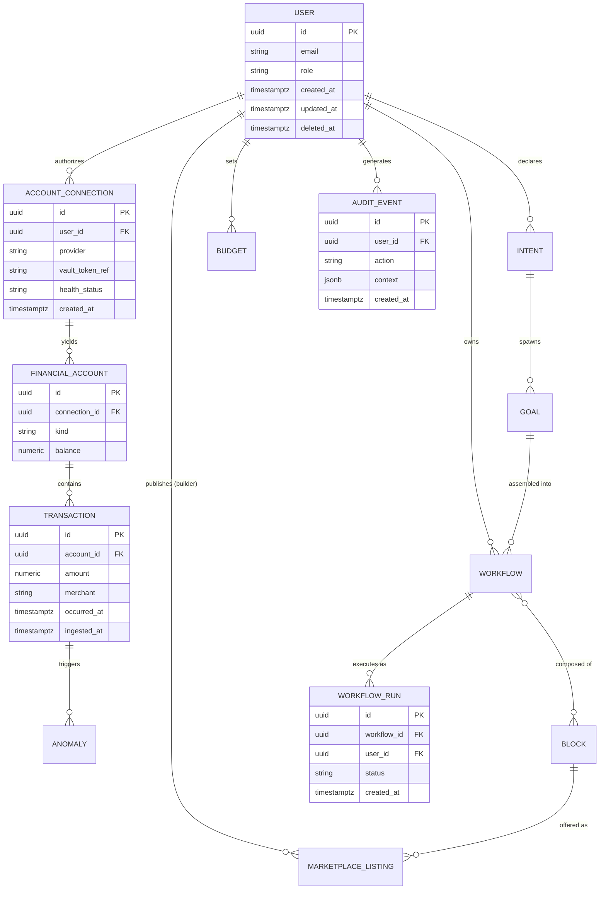

# Foundational Architecture Bet — Wealth at Your Fingertips

> The platform's load-bearing technical decisions, as a wager.

Parent: `docs/foundation/product.md` (FOUNDATION-PRODUCT, `status: approved`) · Research: `docs/foundation/research.md`

## Context

Constraints that shape this architecture, each citing its source:

- **Regulatory** (product Access & Data Posture, product.md L28–32): **MFA-required** auth · **Sensitive** data · **PCI DSS + SOC 2 + GDPR**. Open item: **PSD2 / open-banking** flagged but not selected — applies if/when UK aggregation launches (carried as DRI Risk R4).
- **Team skill** (elicited): solo / small team; TypeScript-first; favors single-language full-stack + managed platforms over hand-run infrastructure.
- **Performance** (from Fitness Functions, derived from KR1 TTFV<3min + north-star WAWU): p95 API < 200ms; TTFV < 3 min; architected from 500 → 3,000 concurrent without re-architecture.
- **Cost** (from research §4 + product moat row 4): aggregation data-access fees are a **first-order variable cost** (Plaid→JPMorgan precedent, research.md L42) — all-in cost/MAU is the headline architectural metric, not infra-only.
- **Workload shape** (derived — product bet is vision-led on workloads): read-heavy session traffic (~90% read), bursty write on aggregation sync, **long-running/scheduled** aggregation + anomaly jobs that must NOT run in a request path.

## Fitness Functions

The measurable architectural targets this bet must satisfy. ≥1 per Well-Architected pillar, each in numbers. These are the bet's falsification criteria.

| Pillar                 | Function (measurable)                                                                         | Threshold                                                                                                                     | Source / rationale                                                                                                                                  |
| ---------------------- | --------------------------------------------------------------------------------------------- | ----------------------------------------------------------------------------------------------------------------------------- | --------------------------------------------------------------------------------------------------------------------------------------------------- |
| Reliability            | Core-path monthly uptime (auth, aggregation read, workflow-run); RPO; RTO                     | 99.9% / RPO ≤ 5 min / RTO ≤ 30 min                                                                                            | Trust moat (product moat row 5) — outages erode the brand/trust prerequisite; 99.9% (not 99.99%) is honest given third-party aggregation dependency |
| Security               | PII encrypted at rest + in transit; MFA enforcement; compliance posture; GDPR DSAR turnaround | 100% PII AES-256 at rest + TLS 1.2+; MFA on 100% of accounts; SOC 2 Type II by Q4 2026; DSAR ≤ 30 days                        | Product Access & Data Posture (product.md L28–32): MFA-required, Sensitive, PCI/SOC2/GDPR                                                           |
| Performance efficiency | p95 API latency (excl. third-party aggregation calls); TTFV; concurrency headroom             | < 200ms; TTFV < 3 min; sustain 500 concurrent now → 3,000 without re-architecture                                             | KR1 (product L43) TTFV<3min; north-star WAWU = action latency matters; concurrency derived at ~5% of forecast                                       |
| Cost optimization      | All-in cost per active user / month (infra + aggregation); infra-only                         | All-in < $1.50; infra-only < $0.40                                                                                            | Research §4 (aggregation fees variable, research.md L42); product moat row 4 (scale economics partial)                                              |
| Operational excellence | Deploy frequency; MTTR; critical-path observability coverage                                  | ≥ daily; MTTR < 30 min; 100% of critical paths instrumented + alerting                                                        | Solo/small team velocity; research-flagged connection-health monitoring (research.md L86)                                                           |
| Sustainability         | Hosting-region carbon posture                                                                 | Not load-bearing at current stage — managed-cloud region with published carbon reporting preferred; **revisit at > 100k MAU** | Honest early-stage assessment (template permits scored n/a-with-reason)                                                                             |

## Decision

Build a **TypeScript full-stack platform on Vercel**: a single Next.js (App Router) application serving both the intent-first front end (React + Turbopack + Tailwind) and a REST/OpenAPI backend (Route Handlers). The system of record is **Supabase** — Postgres + Storage + **Auth** + Vault — used as one coherent managed-data platform. **Supabase Auth** owns identity, sessions, and the **email+password first factor (AAL1)** on a SOC 2 Type II provider, which lets Postgres **row-level security key natively on `auth.uid()`** for the pooled B2C tenancy model. The **second factor is a passkey (WebAuthn)** enforced by a **thin custom layer** (`@simplewebauthn`) — Supabase's own passkey MFA is experimental and not first-class, so we own the WebAuthn ceremony, store credentials in a `WebAuthnCredential` table, and enforce **AAL2 server-side**; TOTP (Supabase-native) is the recovery/fallback factor. See **ADR-001**. Postgres fits the foundational data model's relational entities, UUID v7 identity, JSONB workflow/block configs, append-only audit, and encryption-at-rest; aggregation OAuth tokens are held in **Supabase Vault** (envelope-encrypted, never plaintext). Long-running and scheduled work (aggregation sync, anomaly scans) runs in **Inngest** durable functions, off the request path. Real financial data is pulled **read-only from Plaid** (US institutions; Accounts / Balance / Transactions — see **ADR-002**), with **CSV import** as the coverage-gap fallback. Observability is **Sentry** (matches the configured connector); CI/CD is **Vercel-native with GitHub Actions** gates. Single deploy target: **web (URL)**.

## Foundational Data Model

Conventions every bet inherits. Decided **before** the DB choice — the Database row in the Stack table cites this section.

### Core entities

Each entity traces back to a line in `docs/foundation/product.md`.

| Entity             | Purpose                                                                                       | Traces back to (product bet line / quote)                                                        |
| ------------------ | --------------------------------------------------------------------------------------------- | ------------------------------------------------------------------------------------------------ |
| User               | Auth + identity holder; persona role (consumer/builder/developer)                             | "Target users / personas" L22–26; Access & Data Posture L28                                      |
| AccountConnection  | An authorized aggregation link to a provider (OAuth grant, health, provider id)               | "connects accounts" L23; "2 aggregation providers live" KR2 L53; "OAuth/zero-knowledge only" L57 |
| FinancialAccount   | A real financial account surfaced via a connection (checking, card, investment)               | "≥ 3 connected accounts per active Pro user" KR3 L45; "aggregation" L35                          |
| Transaction        | Aggregated transaction record; source of cash-flow + anomaly signal                           | "daily cash flow + aggregation" L35; anomaly-detection moat L68                                  |
| Intent             | A user's declared intent across the 6 clusters (Fear/Goal/Confusion/Control/Habit/Aspiration) | "intent-first engine" L20; "5 pre-built workflows across all 6 intent clusters" KR1 L51          |
| Goal               | A concrete objective derived from an intent                                                   | "auto-assemble a running workflow from a user's goals" L60                                       |
| Workflow           | A composed, runnable automation (definition)                                                  | "composable workflows" L35; "pre-built/marketplace workflows" L23                                |
| WorkflowRun        | One execution instance of a workflow (the WAWU action unit)                                   | "users taking ≥1 platform-prompted financial action (run/adjust workflow…)" L38                  |
| Block              | A composable financial primitive that workflows are built from                                | "composable library of financial primitives" L20; "blocks" L25                                   |
| MarketplaceListing | A builder-published workflow/block offered in the marketplace                                 | "creator marketplace" L20; Builder persona L24                                                   |
| Anomaly            | A detected irregularity/alert acted on by the user                                            | "act on an anomaly/alert" L38; data-as-moat anomaly detection L68                                |
| Budget             | A monthly plan the user is measured against                                                   | "≥ 70% of users within 10% of monthly budget plan" KR4 L46                                       |
| AuditEvent         | Append-only record of financial-data access + actions + auth events                           | Regulatory moat L71 (SOC2/PCI/GDPR audit trail); data-as-moat L68                                |
| WebAuthnCredential | A user's registered passkey (credential id, public key, sign counter, transports, AAGUID) — the second factor | MFA-required posture (product L29); auth model (ADR-001 — custom WebAuthn 2FA)        |

No invented entities — every row cites the product bet.

### Identity strategy

**UUID v7** (time-sortable, externally safe). Rationale: financial data must not expose enumerable/sequential identifiers (leaks user/account counts → a security concern under the Sensitive posture); v7 keeps index locality (better than v4 for Postgres B-tree inserts) while staying safe to share externally and across provider APIs.

### Tenancy model

**B2C pooled with row-level security (RLS).** Derived from the Consumer-primary persona (~80%, single-player utility, product L23) — a shared schema scoped by `user_id` is correct, not per-customer silos (which are a B2B pattern). The Sensitive posture + data-as-moat push toward **default-deny RLS** + app-layer scoping rather than trust-the-query-builder. The developer/B2B persona (~5%, L25) may later need siloed isolation for enterprise packages — noted as a future evolution (DRI Issue I1-area), not built now.

### Audit / event-sourcing posture

**Full append-only audit log** (`AuditEvent`) for all financial-data access, workflow actions, and auth/MFA events — derived from the regulatory moat (SOC2/PCI/GDPR all require audit trails, product L71) and reinforced by the data-as-moat claim (an immutable action log strengthens anomaly detection). `Transaction` ingestion is treated as an append/CDC stream from aggregation (events preserved); configuration entities (Workflow, Goal, Budget) use created/updated semantics.

### Delete posture

**Soft delete** (`deleted_at`) for user-facing entities (User, Workflow, Goal, Budget, MarketplaceListing). **Retention-bound immutability** for financial + compliance records (Transaction, AuditEvent) — held to a regulatory retention window (target 7 years for financial records) rather than user-driven hard delete. **GDPR erasure** is handled by anonymization + aggregation-token revocation + crypto-shredding of PII columns, not by deleting audit/financial history (right-to-erasure vs. financial-retention reconciled this way).

### PII / sensitive-data handling

PII = email, name, linked-account identifiers, balances, transaction descriptions/merchants, and **aggregation OAuth tokens**. Controls: AES-256 at rest (Postgres + Storage), TLS 1.2+ in transit; **aggregation OAuth tokens stored in Supabase Vault** (pgsodium envelope encryption) — never in application tables in plaintext, and **no bank credentials are ever stored** (OAuth/zero-knowledge only, product L57). Retention: active + 7-year financial window; GDPR DSAR ≤ 30 days (Security fitness function). Directly implements the Security pillar.

### Timestamps convention

UTC everywhere via `timestamptz`. Every table carries `created_at` + `updated_at`; soft-delete entities add `deleted_at`. `Transaction` preserves the source-provider event timestamp distinctly from ingest time.

### Migration strategy

**Expand-contract, online (zero-downtime).** Derived from the Reliability FF (99.9% uptime, no maintenance windows on the financial path) + the Operational-excellence FF (≥ daily deploys). Schema changes ship additive-first, backfill, then contract — managed declaratively via Supabase CLI migrations (SQL in `/supabase/migrations`).

### High-level ERD



## Stack picks (elicited)

Captured via the **elicitation-with-options** pattern in `/setup-foundation-architecture`. Anchor static; layers cascade.

### Anchor: primary language + deployment model

- **Picked option:** **TypeScript + Vercel**
- **Rationale:** Single-language full-stack maximizes solo/small-team velocity and the TTFV<3min + ≥daily-deploy fitness functions; Vercel-managed platform minimizes operational surface at Phase-1 scale.
- **Per-pillar implication:** + Operational excellence (zero-infra deploys) · + Performance (edge/serverless reads) · ~ Cost (scales with traffic; low floor) · ~ Reliability (long-running aggregation needs an off-request durable runtime — addressed by Inngest in Layer 4) · Security/Sustainability neutral (platform-inherited).

### Layer 1 — Frontend stack

- **Picked option:** **Next.js + Turbopack + Tailwind**
- **Cascaded from anchor:** Vercel is Next.js's native platform — tightest integration (RSC streaming, ISR, edge), and it unifies front end with the Layer-2 backend in one framework.
- **Rationale:** The product is a heavily interactive logged-in dashboard (intent onboarding, live workflows) — Next.js's app-shell + RSC model fits far better than content-first Astro; largest ecosystem reduces build risk.
- **Per-pillar implication:** + Performance (RSC/streaming strong p95 for reads) · + Operational excellence (zero-config Vercel deploys) · ~ requires bundle-size discipline to hold the perf FF.

### Layer 2 — Backend stack

- **Picked option:** **Next.js Route Handlers + REST/OpenAPI + Supabase Auth (email+password, AAL1) + custom WebAuthn passkey second factor** (`@simplewebauthn`); TOTP fallback via Supabase. *(Amended by ADR-001 — original pick named Supabase-native passkey MFA, which is experimental.)*
- **Cascaded from anchor + frontend pick:** One Next.js app serves API routes alongside the front end; REST/OpenAPI (over tRPC) chosen because the OpenAPI contract serves the developer/SDK persona (~5%, product L25) and the marketplace/B2B packages (L25) — an internal-only RPC would not.
- **Auth model derived from foundation-product Access & Data Posture:** Product posture is **MFA-required** (product.md L29). **Supabase Auth** provides identity + sessions + the **email+password first factor (AAL1)** on a SOC 2 Type II provider; auth/identity lives in the same Supabase project as the data store, so **Postgres RLS keys natively on `auth.uid()`** with no custom identity bridging. The **passkey second factor is a custom WebAuthn layer** (`@simplewebauthn`) because Supabase-native passkey MFA is experimental (verified 2026-06-05 — ADR-001); Supabase-native **TOTP** is the recovery/fallback factor. **Alignment check (principle #16): satisfies — does not diverge from — the MFA-required posture. The change in *mechanism* (custom WebAuthn vs Supabase-native passkey) is the deviation recorded in ADR-001.**
- **Rationale:** Keeps Supabase for identity/sessions/RLS coherence while preserving the product's lowest-friction passkey-MFA vision via a thin, owned WebAuthn layer rather than waiting on Supabase's experimental roadmap.
- **Per-pillar implication:** + Security (passkey 2FA + native RLS tenancy) · − Security-burden (we now own the WebAuthn ceremony + AAL2 enforcement + credential storage — a financial-app security surface requiring Security Reviewer scrutiny) · − Operational excellence (more auth code to run vs a fully-managed factor) · + Performance (co-located with the data layer).

### Layer 3 — Data stack

- **Picked option:** **Supabase (Postgres + Storage + Auth)** + **Upstash Redis** (cache/rate-limit) + **Supabase Vault** (aggregation-token secrets) + **Vercel env vars** (app config secrets)
- **Cascaded from anchor + backend:** A Vercel-hosted Next app pairs cleanly with managed serverless Postgres; Supabase's first-class RLS + Auth together serve the pooled-tenancy + MFA decisions as one platform (auth is Supabase Auth per Layer 2 — no split identity layer).
- **Database choice derived from Foundational Data Model:** Postgres satisfies every data-model decision above — **UUID v7** native generation; **RLS keyed on `auth.uid()`** delivers the B2C **pooled tenancy** with default-deny; **JSONB** stores Workflow/Block/Intent configs without schema churn; **append-only audit** (`AuditEvent`) is a standard Postgres pattern; **expand-contract online migrations** via Supabase CLI; **encryption-at-rest** + **Supabase Vault** for the aggregation-token PII requirement. A KV store (DynamoDB) was rejected precisely because the model is relational + audit-heavy (see Alternatives).
- **Rationale:** One coherent managed-data platform (Postgres + Storage + Auth + Vault + RLS) satisfies the full data model + MFA posture + compliance, removing the cross-layer identity-bridging risk.
- **Per-pillar implication:** + Security (native RLS via `auth.uid()` + Vault + encryption) · + Reliability (PITR → RPO ≤ 5 min) · + Operational excellence (single platform) · − Reversibility (more of the stack — incl. auth — coupled to Supabase) · ~ Cost (managed; scale-to-zero on low traffic).

### Layer 4 — Ops stack

- **Picked option:** **Vercel native CI/CD + Sentry + Inngest + GitHub Actions checks**
- **Cascaded from anchor + prior picks:** Vercel-native deploy is the zero-friction path for a Next/Vercel app; Sentry matches the configured `connectors.observability: sentry`; **Inngest** supplies the durable, retryable runtime the serverless anchor lacks for **aggregation sync + scheduled anomaly scans** (the long-running workload identified in Context); GitHub Actions runs lint/typecheck/test gates pre-merge.
- **Rationale:** Lowest operational burden that still solves durable jobs and meets the ≥daily-deploy + MTTR<30min ops FFs; observability choice aligns with existing config (no connector drift).
- **Per-pillar implication:** + Operational excellence (preview deploys, daily cadence trivial) · + Reliability (Inngest retries/durability for sync) · ~ Cost (Sentry + Inngest add small managed cost) · deploy target = **web (URL)** → maps to a **single Phase-B canary kind: `web`**.

## Stack

| Concern                   | Choice                                                                                                                 | Reversibility                         |
| ------------------------- | ---------------------------------------------------------------------------------------------------------------------- | ------------------------------------- |
| Repo shape                | Monorepo (Next.js app + `/packages/*` + `/supabase`)                                                                   | medium                                |
| Backend language          | TypeScript                                                                                                             | hard                                  |
| Backend framework         | Next.js Route Handlers (App Router)                                                                                    | medium                                |
| Frontend framework        | Next.js + React (Turbopack, Tailwind)                                                                                  | medium                                |
| Mobile framework          | None at Phase 1 — web-first (Expo/React Native deferred to a later architectural-initiative bet)                       | n/a — deferred                        |
| Database                  | Supabase Postgres (cites Foundational Data Model)                                                                      | hard (low lock-in: standard Postgres) |
| Cache                     | Upstash Redis                                                                                                          | medium                                |
| Object storage            | Supabase Storage                                                                                                       | medium                                |
| Account aggregation       | **Plaid** (read-only OAuth; US institutions; Accounts / Balance / Transactions) — see ADR-002; CSV import for coverage gaps | medium (adapter-isolated)        |
| Contracts format          | REST + OpenAPI                                                                                                         | medium                                |
| Auth model                | Supabase Auth (email+password AAL1) + **custom WebAuthn passkey 2FA** (`@simplewebauthn`, AAL2 server-side) + TOTP fallback; RLS via `auth.uid()` — see ADR-001 | hard (GoTrue + owned WebAuthn layer)  |
| Secrets management        | Supabase Vault (aggregation tokens) + Vercel env vars (app config)                                                     | hard                                  |
| Background/scheduled jobs | Inngest (durable functions)                                                                                            | medium                                |
| Deployment target         | Vercel (serverless, cloud) — target: web (URL)                                                                         | one-way (platform)                    |
| CI/CD platform            | Vercel native + GitHub Actions checks                                                                                  | medium                                |
| Observability             | Sentry (matches config connector)                                                                                      | medium                                |
| Infrastructure-as-code    | Vercel project config + Supabase CLI migrations (declarative SQL); Pulumi/Terraform deferred until infra surface grows | medium                                |

### Per-row pillar evaluation + research citations

Full 6-pillar blocks for the load-bearing rows; compact scoring for low-stakes rows follows.

#### Database: Supabase Postgres

| Pillar                 | Score      | Rationale                                                                                          | Research citation                                          |
| ---------------------- | ---------- | -------------------------------------------------------------------------------------------------- | ---------------------------------------------------------- |
| Reliability            | good       | PITR + managed HA → RPO ≤ 5 min FF; mature engine                                                  | Arch Research §5 (Postgres pillar fit); Supabase PITR docs |
| Security               | good       | RLS default-deny tenancy + Vault token encryption + AES-256 at rest; fits Sensitive posture        | §5; product Access & Data Posture                          |
| Performance efficiency | good       | Indexed relational reads + JSONB; trivial at 10k–1M users, read-heavy                              | §2 (Postgres handles this scale comfortably)               |
| Cost optimization      | acceptable | Managed pricing + scale-to-zero on low traffic; DB is not the dominant cost (aggregation fees are) | §2 cost; research.md §4                                    |
| Operational excellence | good       | Declarative migrations (Supabase CLI), expand-contract online                                      | §5                                                         |
| Sustainability         | acceptable | Managed multi-tenant Postgres; not load-bearing at stage                                           | honest n/a                                                 |
| **Reversibility**      | —          | **Low lock-in** — standard SQL, `pg_dump` to any Postgres host                                     | §6 (Postgres is portable; Supabase = managed Postgres)     |

#### Auth model: Supabase Auth (TOTP + passkey MFA)

| Pillar                 | Score      | Rationale                                                                                                                                                                             | Research citation                                       |
| ---------------------- | ---------- | ------------------------------------------------------------------------------------------------------------------------------------------------------------------------------------- | ------------------------------------------------------- |
| Reliability            | good       | Managed auth on the same platform as data; no separate identity service to fail or sync                                                                                               | §3 (Supabase maturity)                                  |
| Security               | good       | Managed MFA on a SOC 2 Type II provider; **native RLS via `auth.uid()`** removes the custom-tenancy-wiring failure mode                                                               | §4 (RLS misconfig failure mode now native); product L29 |
| Performance efficiency | good       | Co-located with the data layer, no extra auth hop                                                                                                                                     | §5                                                      |
| Cost optimization      | acceptable | Supabase Auth MAU pricing (bundled into the Supabase plan)                                                                                                                            | §2                                                      |
| Operational excellence | good       | Managed MFA flows + recovery; less to run than self-hosted auth                                                                                                                       | §4                                                      |
| Sustainability         | n/a        | not load-bearing                                                                                                                                                                      | —                                                       |
| **Reversibility**      | —          | **Medium-hard** — GoTrue/Supabase Auth lock-in on identity (the trade taken to drop custom RLS wiring); user records are exportable but MFA enrollments + flows are Supabase-specific | §6                                                      |

#### Deployment/Platform: Vercel (serverless)

| Pillar                 | Score      | Rationale                                                                                                      | Research citation                                                      |
| ---------------------- | ---------- | -------------------------------------------------------------------------------------------------------------- | ---------------------------------------------------------------------- |
| Reliability            | good       | Managed edge 99.99%; **long-running gap** mitigated by Inngest off-request                                     | §4 (serverless timeout failure mode); §1 (fintech-on-Vercel prior art) |
| Security               | good       | SOC2-inheritable platform; we own app layer                                                                    | §5                                                                     |
| Performance efficiency | good       | Edge/serverless strong p95 for read traffic; meets <200ms FF                                                   | §2 (TechEmpower Node tier)                                             |
| Cost optimization      | acceptable | Scales with traffic — low floor, watch at scale                                                                | §2 (Vercel cost calculators)                                           |
| Operational excellence | good       | Preview deploys, ≥daily cadence trivial → ops FF                                                               | §1                                                                     |
| Sustainability         | acceptable | Managed regions, carbon-reported                                                                               | honest                                                                 |
| **Reversibility**      | —          | **Medium** — Next.js self-hostable on Node, but Vercel-specific features (ISR/edge config) create soft lock-in | §6                                                                     |

#### Background jobs: Inngest

| Pillar                 | Score      | Rationale                                                            | Research citation                         |
| ---------------------- | ---------- | -------------------------------------------------------------------- | ----------------------------------------- |
| Reliability            | good       | Durable, retryable steps for aggregation sync → protects RPO ≤ 5 min | §4 (serverless long-running failure mode) |
| Security               | acceptable | Jobs access Vault tokens server-side; no client exposure             | §5                                        |
| Performance efficiency | good       | Off-request execution keeps API p95 clean                            | §2                                        |
| Cost optimization      | acceptable | Small managed cost; usage-priced                                     | §2                                        |
| Operational excellence | good       | Observable runs, replay; less to operate than self-run queue         | §3                                        |
| Sustainability         | n/a        | not load-bearing                                                     | —                                         |
| **Reversibility**      | —          | **Medium** — job DSL is Inngest-specific; QStash/Temporal are exits  | §6 (vendor-health risk, DRI R3)           |

#### Frontend: Next.js + Turbopack + Tailwind

| Pillar                 | Score      | Rationale                                                                | Research citation |
| ---------------------- | ---------- | ------------------------------------------------------------------------ | ----------------- |
| Reliability            | good       | Mature, dominant React meta-framework                                    | §3                |
| Security               | good       | RSC keeps secrets server-side by default                                 | §5                |
| Performance efficiency | good       | RSC/streaming + Turbopack; meets perf FF with bundle discipline          | §2                |
| Cost optimization      | good       | No separate FE host/build infra                                          | §2                |
| Operational excellence | good       | One framework, one deploy                                                | §1                |
| Sustainability         | acceptable | shared with platform                                                     | honest            |
| **Reversibility**      | —          | **Medium** — React portable; Next App Router idioms create some coupling | §6                |

**Compact scoring — low-stakes rows** (all 6 pillars acceptable+ unless noted):

- **Repo shape (monorepo):** + ops/coherence for shared `packages`; reversibility medium. Pillars: ops/perf good, others neutral. [§1]
- **TypeScript / Next Route Handlers / REST+OpenAPI:** velocity + open contracts (SDK persona); pillars neutral-to-good; reversibility hard (language) / medium (contracts). [§3]
- **Upstash Redis (cache):** perf/cost good; reversibility medium (standard Redis protocol). [§2/§6]
- **Sentry (observability):** ops/reliability good; matches config connector (no drift); reversibility medium. [§3]
- **Supabase Vault + Vercel env (secrets):** security good (Vault envelope-encrypts tokens); reversibility hard (token re-encryption on exit). [§5]

## Boundaries (initial)

Monorepo directory structure all bets start from:

```
/app                 Next.js App Router — routes, RSC pages (the intent-first UI)
/app/api             Route Handlers — REST endpoints (OpenAPI-described)
/packages/core       Domain logic — intents, goals, workflow/block engine
/packages/db         Supabase client, schema types, RLS policy helpers
/packages/aggregation  Provider adapters (Plaid etc.) + Vault token access
/packages/jobs       Inngest functions — aggregation sync, anomaly scans
/packages/ui         Shared React + Tailwind components
/packages/contracts  OpenAPI spec + generated client/types
/supabase            Migrations (SQL), RLS policies, seed
```

## Cross-cutting standards

- **Logging:** structured JSON, correlation IDs, **no PII in logs**; Sentry breadcrumbs on critical paths.
- **Error handling:** typed errors; **fail-closed** on auth/tenancy; never leak internal/financial detail to the client.
- **Naming:** `snake_case` in Postgres, `camelCase` in TS, `kebab-case` filenames.
- **Testing:** unit (domain) + API (Route Handlers) + **RLS policy tests** (cross-tenant default-deny) + E2E (Playwright, authored by the Codex reviewer); aggregation adapters mocked in CI.
- **Observability:** Sentry errors + performance on 100% of critical paths (auth/MFA, aggregation sync, workflow-run); connection-health dashboard; alerts wired to the uptime + MTTR fitness functions.

## Hypothesis (the bet)

This **TypeScript + Vercel + Next.js + Supabase (Postgres + Auth) + Inngest** stack will support the intent-first wealth-orchestration platform for ~2–3 years, through ~1M MAU, with a solo/small team — holding **p95 < 200ms**, **≥ daily deploys**, **SOC 2 Type II by Q4 2026**, and **all-in cost/MAU < $1.50**. **Wrong if:** aggregation sync can't hold RPO ≤ 5 min on serverless + Inngest, OR Supabase (single-platform for data + auth) becomes a cost or scaling bottleneck before we've earned the option to migrate off it, OR all-in cost/MAU exceeds $1.50 at scale because aggregation fees dominate.

## Guardrail metrics

What must NOT degrade for this architecture to count as won:

- **All-in cost/MAU:** stays < $1.50 (infra-only < $0.40)
- **Deploy frequency:** stays ≥ daily; **MTTR:** stays < 30 min
- **p95 API latency:** stays < 200ms (excl. aggregation calls)
- **Core-path uptime:** stays ≥ 99.9%

## Alternatives considered

Evaluated against the declared fitness functions — not generic pros/cons, not strawmen.

| Option                                                             | Fitness-function fit                                                                                                                                                | Pillar tradeoffs                                                                                                                                | Why rejected                                                                                                                                        |
| ------------------------------------------------------------------ | ------------------------------------------------------------------------------------------------------------------------------------------------------------------- | ----------------------------------------------------------------------------------------------------------------------------------------------- | --------------------------------------------------------------------------------------------------------------------------------------------------- |
| **Chosen** — TS+Vercel+Next+Supabase(Postgres+Auth)+Sentry+Inngest | Meets ops (≥daily/ MTTR<30m), perf (p95<200ms), security (managed MFA + native RLS + Vault), cost (<$1.50 with care); durable jobs solve the serverless gap         | Favors security-coherence + ops-excellence + velocity; costs Supabase Auth lock-in                                                              | —                                                                                                                                                   |
| **Alt A — TypeScript + AWS (ECS/Fargate)**                         | Meets reliability/perf at scale; **fails Operational-excellence FF** (≥daily deploy / MTTR<30min) for a solo team — large ops surface; over-built for Phase-1 scale | + control/scale-economics, − ops burden, − cost floor early                                                                                     | Fails ops-excellence + cost-floor FFs at current stage; revisit if scale economics dominate later (ADR path)                                        |
| **Alt B — Python + managed PaaS (FastAPI)**                        | ML-friendly for the anomaly moat; **fails velocity / ops FF** — splits FE/BE, two languages, slower to TTFV<3min web product                                        | + data/ML, − split-stack ops, − single-language velocity                                                                                        | Fails ops-excellence (split deploys) + team-velocity; anomaly ML can be a later Python micro-service behind the API                                 |
| **Auth alt — Auth.js (self-hosted)**                               | Meets Security FF; auth data fully portable (low lock-in)                                                                                                           | + no auth-vendor lock, + open, − **we own MFA correctness + SOC2/PCI evidence**, − **custom RLS wiring** to bridge identities into `auth.uid()` | Rejected: re-introduces the auth/data split-identity risk (former R1) for portability we don't need at this stage; Supabase Auth keeps RLS native   |
| **Auth alt — Clerk (managed MFA)**                                 | Meets Security FF (managed MFA + SOC2 provider)                                                                                                                     | + offloads MFA compliance, − per-MAU cost, − separate vendor + identity-to-RLS bridging                                                         | Rejected: a separate auth vendor still needs identity bridged into Postgres RLS; Supabase Auth gives managed MFA **and** native RLS in one platform |
| **DB alt — DynamoDB (KV)**                                         | **Fails the Foundational Data Model** — relational entities + append-only audit + RLS tenancy need SQL, not KV                                                      | + scale/cost at extreme write volume, − relational/audit fit                                                                                    | Rejected: ignores entity shape + audit posture (decide-before-derive anti-pattern)                                                                  |

## Architecture Research

Findings from the 6-category framework (`compass/roles/enterprise-architect.md` → "Where to research"). Per [cite-or-mark-n/a] each category produces evidence or a justified n/a.

### 1. Prior art

Comparable PFM/fintech products converge on **managed Postgres + a JS meta-framework + a managed durable-job runtime**. Monarch Money (the direct Mint-successor in research.md §2) is a React + managed-Postgres product; numerous YC/early fintechs run **Next.js on Vercel + Postgres** for the request tier with aggregation handled off-request. Aggregation vendors (Plaid) document Postgres as the canonical transaction store. _Sources:_ research.md §2 (competitive set); Plaid integration docs; common fintech-on-Vercel prior art.

### 2. Benchmarks

The request tier is **read-heavy at modest concurrency** (≤ 3k concurrent target). Node/Next API handlers clear < 200ms p95 well within this envelope (TechEmpower Node framework tier). Postgres handles 10k–1M-user transaction stores with simple indexing; the DB is **not** the dominant cost — aggregation data-access fees are (research.md §4). _Sources:_ TechEmpower web-framework benchmarks; Vercel/Supabase cost calculators; research.md L42.

### 3. Vendor health

Next.js/Vercel — dominant, very active. Auth.js (NextAuth) — large adoption, MIT, active. Supabase — well-funded, Postgres-standard (so portability de-risks vendor exposure). Sentry — mature, stable, the configured connector. **Inngest — youngest/smallest vendor in the stack → the principal vendor-health risk** (DRI R3); reversible via QStash/Temporal. _Sources:_ GitHub activity + license terms; vendor funding posture.

### 4. Failure modes

(a) **Serverless + long-running aggregation in the request path → timeouts** — the explicit reason aggregation/anomaly work runs in Inngest, not in Route Handlers (Vercel function limits). (b) **RLS misconfiguration → cross-tenant data leak**, a classic Postgres multi-tenant failure — mitigated by default-deny policies + RLS tests (DRI R1). (c) **Aggregation cost/liability** — Plaid→JPMorgan paid-access shift + Plaid's $58M data-practices settlement (research.md L42–43) — architecture isolates tokens in Vault + supports multi-provider + CSV fallback. _Sources:_ Vercel function-limit docs; Supabase RLS guidance; research.md §4.

### 5. Pillar fit

Postgres maps cleanly to every pillar for relational + audit workloads (RLS → Security/tenancy; PITR → Reliability). Vercel is strong on ops/perf, weaker on long-running (mitigated by Inngest), cost-scales-with-traffic. Supabase Auth is pillar-strong on Security (managed MFA + native `auth.uid()` RLS) and Operational excellence, trading Reversibility (GoTrue lock-in). _Sources:_ AWS Well-Architected pillar definitions (portable); Supabase + Vercel pillar docs.

### 6. Reversibility honesty

Lowest lock-in: **Postgres** (standard SQL, `pg_dump` — user/data rows export cleanly). Medium: **Vercel** (Next.js self-hostable, but ISR/edge features couple), **Inngest** (job DSL specific), **Upstash/Supabase Storage** (standard-ish protocols/APIs). **Higher (deliberate trade): Supabase Auth / GoTrue** — choosing managed Supabase Auth (over self-hosted Auth.js) accepts identity-layer lock-in in exchange for **native `auth.uid()` RLS** and offloaded MFA compliance; user records export but MFA enrollments + auth flows are Supabase-specific, so an exit means re-enrolling MFA on a new provider. _Sources:_ `pg_dump`/Postgres portability; Supabase Auth (GoTrue) export limits; Next.js self-host docs; Inngest vs. QStash/Temporal interop.

## Signal consultation (existing project signal)

Per [cite-or-mark-n/a], each of the 5 categories produces a citation or a justified `n/a`. This is an initial **v1 greenfield** draft, so most are trivially n/a.

1. **Production observability:** `n/a — greenfield`. No production deployment; Sentry connector configured in `compass/config.yaml` but no MCP connected on this host and no telemetry exists yet (cf. research.md L81 "no first-party telemetry pre-launch").
2. **Recent PR feedback:** `n/a — no PRs in foundational scope`. Repo history is Compass-framework commits only; no application PRs with Codex BLOCKERs/ISSUEs in architectural scope.
3. **Prior architectural decisions across bets:** `n/a — no bets yet`. `docs/bets/` is empty; no `docs/bets/*/architecture.md` to consult.
4. **Bet-architecture deviation pressure:** `n/a — no bets yet`. No open bet has hit the `/create-bet-architecture` deviation gate awaiting this foundation.
5. **Team playbooks:** `n/a — empty (first-project bootstrap)`. `docs/playbooks/` does not yet exist; created lazily in Phase B and populated via `/measure` soft-prompts as bets resolve.

## Consequences

**Positive:**

- Single TypeScript full-stack → maximum solo/small-team velocity (TTFV + deploy-frequency FFs).
- Postgres fits the foundational data model + compliance posture with low lock-in.
- Managed platform (Vercel + Supabase) keeps operational surface tiny; Sentry aligns with the existing connector (no drift).
- Inngest cleanly solves the serverless long-running-aggregation gap with durability/retries.

**Negative:**

- Aggregation/sync lives in a **separate runtime** (Inngest) — an added moving part + the stack's youngest vendor.
- More of the stack — **including auth** — is coupled to Supabase (the trade taken to get native RLS + managed MFA; see Lock-in).
- Serverless cost scales with traffic — needs watching against the cost/MAU FF as usage grows.

**Lock-in:**

- **Supabase as a single platform** (Postgres + Auth + Storage + Vault) — Postgres/data exits cleanly (`pg_dump`), but **Supabase Auth / GoTrue** identity + MFA enrollments are Supabase-specific (medium-hard).
- Vercel platform features (ISR/edge) — medium, soft.
- Inngest job DSL — medium.
- Supabase Vault token encryption — exit requires token re-encryption/migration (hard).
- Postgres data layer — low.

## Repo scaffolding completed

_(Phase B — completed 2026-06-05 after HITL approval.)_

- [x] Boundary folders created (`/app` + `/packages/{core,db,aggregation,jobs,ui,contracts}` + `/supabase`)
- [x] CI/CD pipeline files in place (`.github/workflows/ci.yml` — lint/typecheck/test; Vercel native deploy)
- [x] Base configs (tsconfig, eslint, tailwind, postcss, prettier, next.config, vercel.json)
- [x] `compass/config.yaml` populated with team decisions (`foundation_stack:` block + `ci_cd.canary_artifacts[]`)
- [x] `docs/playbooks/` directory created (`README.md` pointing at `compass/templates/playbook.md`)
- [x] **Web canary green:** https://home-app-brown-nu.vercel.app/api/health → 200 (verified 2026-06-05T16:44:36Z)

## ADR / Amendments

### ADR-001 — Passkey MFA moves from Supabase-native to a custom WebAuthn layer (2026-06-05)

**Triggered by:** Bet **WLT-1 / story WLT-6** (`/build WLT-6`) hit the deviation gate. Implementing the story surfaced that the v1 auth model's claim — "Supabase Auth — TOTP + passkey MFA" — is **factually wrong**: Supabase Auth's MFA second factors are **TOTP and Phone only**; WebAuthn/passkeys are **experimental** (`auth.experimental.passkey`), "not first-class," and not on Supabase's immediate roadmap. The v1 claim was written without primary-source verification.

**What changed:**
- **Decision** paragraph, **Layer 2** pick, **Stack table** "Auth model" row, and **§5 pillar-fit** updated: passkey is now a **custom WebAuthn second factor** (`@simplewebauthn`) over Supabase email+password (AAL1); **AAL2 enforced server-side** in our middleware/route handlers; Supabase-native **TOTP** is the recovery/fallback factor.
- **Foundational Data Model** gains the **`WebAuthnCredential`** entity (credential id, public key, sign counter, transports, AAGUID, `user_id`) under the same default-deny RLS + UUID-v7 conventions.
- Auth model **reversibility** downgraded: we now own the WebAuthn ceremony + credential storage (a financial-app security surface).

**Why:** Product posture is **MFA-required** with the lowest-friction factor (passkey-first — WLT-1 brief). The v1 mechanism (Supabase-native passkey) cannot deliver it on supported infra. Options weighed: (A) ship TOTP-only — supported but abandons the passkey vision; (B) **custom WebAuthn layer — chosen** — preserves passkey-first at the cost of owned auth code; (C) Supabase experimental passkey — rejected as too unstable for a financial trust-gate. User direction 2026-06-05.

**Reversibility:** medium — WebAuthn is a W3C standard; credentials live in our Postgres (`WebAuthnCredential`), portable. Exit path: adopt Supabase-native passkey MFA if/when it goes first-class, migrating stored credentials.

**Cited signal:** Supabase MFA docs (https://supabase.com/docs/guides/auth/auth-mfa — TOTP + Phone only); Supabase MFA features page; Supabase WebAuthn factors (experimental). Verified via WebFetch + WebSearch on 2026-06-05. Foundational fitness functions unchanged (Security FF still "MFA on 100% of accounts").

### ADR-002 — Account-aggregation provider selected: Plaid (2026-06-07)

**Triggered by:** Bet **WLT-2** (`/create-bet-architecture WLT-2`) hit the step-7 deviation gate. The v1 architecture anticipated an aggregation provider throughout (Vault holds its tokens, Inngest runs its sync, the `AccountConnection`/`FinancialAccount`/`Transaction` entities model its data, and the cost FF counts its fees) but **never selected a specific vendor**. The provider the entire product's data flows through is a foundational-scope decision, not a bet-level pick — so the bet architecture halted and routed it here.

**What changed:**
- **Stack table** gains an **"Account aggregation"** row: **Plaid** (read-only OAuth; US institutions; Accounts / Balance / Transactions APIs), reversibility **medium** (adapter-isolated). The **Decision** paragraph + the `key_metric` cost source now name Plaid.
- Phase-1 scope locked: **read-only**, **US-only**, **depository + credit** accounts; **CSV import** is the coverage-gap fallback (Plaid excludes Fidelity + some credit unions). PSD2/open-banking stays deferred (R4).
- No new fitness functions: the cost FF already reads "incl. aggregation," and the reliability FF already caveats "third-party aggregation dependency."

**Why:** Plaid has the **widest US institution coverage** (12k–16k+), the strongest **developer experience + docs**, **OAuth/zero-knowledge** linking (no stored bank credentials — satisfies product L57), and is the **reference aggregator** comparable products build on. Options weighed against the fitness functions: (A) **Plaid — chosen** — best coverage + DX, accepts variable per-connection fees; (B) **MX** — strong enrichment but smaller US coverage + heavier enterprise onboarding; (C) **Teller** — developer-friendly + cheaper but narrower coverage; (D) **Finicity** (Mastercard) — solid but enterprise-sales-oriented, weaker self-serve DX. Decisive FFs: **coverage** (data quality is the comparable-product long pole) + **DX** (solo-team velocity). Cost is a managed margin risk, not a chooser. User direction 2026-06-07.

**Reversibility:** medium — Plaid is wrapped behind an **aggregation adapter** (interface defined in the WLT-2 bet architecture); accounts/transactions persist in our Postgres in a **provider-neutral schema**, so a second provider (KR2) or a replacement is an additive adapter, not a re-platform. The lock-in is the user **re-link** cost on a switch, not the data.

**Cited signal:** Plaid coverage 12k–16k+, excludes Fidelity + some credit unions (research.md §4 / L41); Plaid→JPMorgan paid-access precedent → variable per-user cost (research.md L42; Bloomberg Law 2025); $58M data-practices settlement (research.md L43). WLT-2 brief deferred provider selection to this gate.

## Check-in log

_Populated automatically by `/measure` cron._

## DRI Log

### Decisions

- [2026-06-05] [Enterprise Architect] **Anchor = TypeScript + Vercel** (full-stack Next.js, serverless)
  - **Rationale:** Single-language full-stack maximizes solo/small-team velocity and the TTFV<3min + ≥daily-deploy fitness functions; managed platform minimizes ops surface at Phase-1 scale.
  - **Area:** architectural / infrastructure
  - **Alternatives considered:** TS+AWS (rejected — fails ops-excellence + cost-floor FFs for a small team early); Python+PaaS (rejected — split-stack, fails velocity FF).
  - **Reversibility:** hard (deployment target is a near one-way door).

- [2026-06-05] [Enterprise Architect] **Supabase as the managed-data platform — Postgres + Storage + Auth + Vault (one coherent platform)**
  - **Rationale:** Postgres satisfies the full Foundational Data Model (UUID v7, RLS pooled tenancy, JSONB configs, append-only audit, encryption-at-rest, Vault token handling); keeping **Auth on Supabase** lets RLS key natively on `auth.uid()` with no cross-layer identity bridging.
  - **Area:** data
  - **Alternatives considered:** DynamoDB (rejected — KV fails relational + audit + RLS fit); all-Vercel data (rejected — Vercel env secrets lack rotation/audit for PCI/SOC2); split data/auth with Auth.js (rejected — re-introduces custom-RLS-wiring risk, former R1).
  - **Reversibility:** hard at the choice level; **data low lock-in** (standard Postgres, `pg_dump`), **auth medium-hard lock-in** (GoTrue-specific MFA enrollments).

- [2026-06-05] [Enterprise Architect] **Supabase Auth (TOTP + passkey MFA) implements the MFA-required posture** _(supersedes the initial Auth.js draft pick per user direction 2026-06-05)_
  - **Rationale:** Managed MFA on a SOC 2 Type II provider + **native `auth.uid()` RLS** removes the custom-tenancy-wiring failure mode and offloads MFA correctness/compliance; satisfies product Access & Data Posture (MFA-required) without divergence.
  - **Area:** security
  - **Alternatives considered:** Auth.js self-hosted (rejected — split identity → custom RLS wiring for portability not needed at this stage); Clerk (rejected — separate vendor still needs identity bridged into Postgres RLS).
  - **Reversibility:** hard — accepts Supabase Auth / GoTrue lock-in as a deliberate trade.

- [2026-06-05] [Enterprise Architect] **Sentry observability + Inngest durable jobs**
  - **Rationale:** Sentry matches `connectors.observability: sentry` (no connector drift); Inngest supplies the durable/retryable runtime the serverless anchor lacks for aggregation sync + scheduled anomaly scans.
  - **Area:** infrastructure / operations
  - **Alternatives considered:** Datadog+Terraform (rejected — connector drift + cost at low scale); Pulumi IaC (deferred — infra surface too small now).
  - **Reversibility:** medium.

- [2026-06-07] [Enterprise Architect] **Account-aggregation provider = Plaid (ADR-002)** _(fills the always-anticipated aggregation-provider slot; triggered by WLT-2's deviation gate)_
  - **Rationale:** widest US institution coverage (12k–16k+) + strongest DX/docs + OAuth/zero-knowledge; coverage is decisive since data quality is the comparable-product long pole. Read-only / US-only / depository+credit for Phase 1; CSV import covers Plaid's gaps (Fidelity, some credit unions).
  - **Area:** data / integrations
  - **Alternatives considered:** MX (rejected — smaller US coverage, heavier enterprise onboarding); Teller (rejected — narrower coverage despite better price/DX); Finicity (rejected — enterprise-sales-oriented, weak self-serve DX).
  - **Reversibility:** medium — adapter-isolated behind a provider-neutral transaction schema; 2nd provider (KR2) is additive. Variable per-connection fees (Plaid→JPMorgan) are a tracked margin risk, not a chooser.

- [2026-06-05] [Enterprise Architect] **Confluence/Jira mirroring skipped (step 16)**
  - **Rationale:** `connectors.docs: confluence` is set but no Confluence/Jira MCP is connected on this host (same posture as the product bet's PM DRI). Logged per "no silent skips."
  - **Area:** process / tooling
  - **Alternatives considered:** block on mirroring (rejected — would stall an otherwise-complete draft).
  - **Reversibility:** easy (re-run mirror when MCP connected).

- [2026-06-05] [Enterprise Architect] **Passkey MFA via custom WebAuthn layer, not Supabase-native (ADR-001)** _(supersedes the 2026-06-05 "Supabase Auth — TOTP + passkey MFA" decision; that claim was unverified and is factually wrong — Supabase MFA = TOTP/Phone only, passkey experimental)_
  - **Rationale:** Preserve the product's passkey-first MFA-required posture (lowest-friction factor) by owning a thin `@simplewebauthn` second-factor layer over Supabase email+password, rather than abandoning passkeys for TOTP or depending on Supabase's experimental passkey feature.
  - **Area:** security / architectural
  - **Alternatives considered:** TOTP-only (rejected — abandons passkey vision); Supabase experimental passkey (rejected — unstable for a financial trust gate).
  - **Reversibility:** medium — WebAuthn is a W3C standard; credentials in our Postgres; migrate to Supabase-native passkey if/when first-class.

### Risks

- [2026-06-05] [Enterprise Architect] **R1 — Auth/data overlap: Supabase RLS must be wired to Auth.js identities (not Supabase Auth)**
  - **Likelihood:** medium · **Impact:** high (cross-tenant financial-data leak if misconfigured)
  - **Mitigation:** default-deny RLS + `set local app.user_id` from Auth.js session + app-layer scoping + dedicated RLS cross-tenant tests; **validate in the Phase-B web canary** before any bet builds on it.
  - **Area:** security / data
  - **Resolution:** [2026-06-05] **Resolved by design** — per user direction, dropped Auth.js and adopted **Supabase Auth**, so RLS keys natively on `auth.uid()` with no custom identity bridging. The split-identity failure mode is eliminated. Residual concern downgraded to standard RLS hygiene: default-deny policies + cross-tenant RLS tests still required (folded into Cross-cutting standards → Testing) and still validated in the Phase-B canary.

- [2026-06-05] [Enterprise Architect] **R5 — Owned WebAuthn layer is a self-built auth security surface on a financial app (ADR-001)**
  - **Likelihood:** medium · **Impact:** high (auth bypass / AAL2 not truly enforced / credential mishandling)
  - **Mitigation:** use vetted `@simplewebauthn` (no hand-rolled crypto); enforce AAL2 in server middleware + route handlers (never client-only); challenge nonce single-use + origin/RP-ID pinned; cross-tenant + AAL RLS tests; **mandatory Security Reviewer (Codex) pass** before merge (diff touches auth → Phase 5 step 16 auto-engages).
  - **Area:** security
  - **Resolution:** [pending — gated on WLT-6 Security Review]

- [2026-06-05] [Enterprise Architect] **R2 — Aggregation token handling + variable data-access cost**
  - **Likelihood:** medium-high · **Impact:** high (PII exposure + margin erosion)
  - **Mitigation:** OAuth tokens only in Supabase Vault (envelope-encrypted), never plaintext, no bank credentials stored; model Plaid→JPMorgan-style fees (research.md L42) as a first-order cost; multi-provider + CSV fallback.
  - **Area:** security / financial

- [2026-06-05] [Enterprise Architect] **R3 — Inngest vendor health (youngest/smallest vendor in the stack)**
  - **Likelihood:** low-medium · **Impact:** medium (re-platform durable jobs if vendor falters)
  - **Mitigation:** keep job logic thin + portable; QStash / Temporal / Vercel Cron + queue as documented exits.
  - **Area:** vendor / operations

- [2026-06-05] [Enterprise Architect] **R4 — PSD2 / open-banking gap (carried from product DRI)**
  - **Likelihood:** medium · **Impact:** high (regulatory blocker for UK aggregation)
  - **Mitigation:** US-first launch; resolve PSD2 applicability + licensing before any UK aggregation; do not widen scope here.
  - **Area:** regulatory

### Issues

- [2026-06-05] [Enterprise Architect] **I1 — Mobile framework deferred**
  - **Severity:** P3 · **Owner:** Enterprise Architect · **Status:** open
  - **Area:** architectural — Phase 1 is web-only; an Expo/React Native decision (and possible B2B siloed-tenancy evolution for the developer persona) is deferred to a later architectural-initiative bet.

---

_Approved by: <pending HITL> on <date>_
