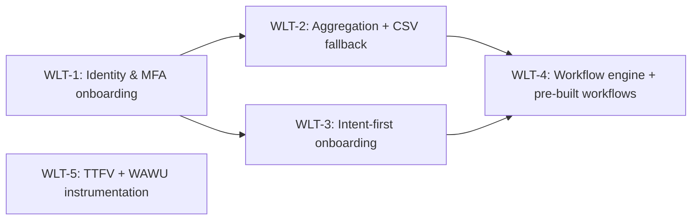

> **Primary artifact (stakeholders read here):** https://docs.google.com/document/d/1xo-YGXxGIuv7Vl0GDDx8ohG9d3GndlP5ImCRSgmA8wo/edit
> This repo file is a slim pointer + inline cache for AI consumption. Edit the Google Doc; re-sync this cache. To approve: flip `status: proposed → approved` here AND rename the Doc title `[PROPOSED]` → `[APPROVED]`.

# MVP Bet Portfolio — Wealth at Your Fingertips

> The initial bet wedge — what we build together so one real user can complete the core value loop once. Bootstrap-only: created once, after foundation product + architecture were approved (both 2026-06-05).

## MVP definition

> _Verbatim user answer to the forcing question:_ **"What does this product need to do for one real user to complete the core value loop once?"**

"A real user signs up with MFA, connects one real account (or imports CSV), declares an intent, gets an auto-assembled running workflow, and completes one platform-prompted action — with TTFV instrumented."

## MVP bets

Each stub brief lives at `docs/bets/<bet-id>/brief.md` with `portfolio_stub: true` until promoted via `/create-brief <bet-id>`.

| Bet ID | Title | One-line hypothesis | Type | Depends on | Parallel with |
|--------|-------|---------------------|------|------------|---------------|
| WLT-1 | Identity & MFA onboarding | If sign-up with managed MFA (TOTP + passkey via Supabase Auth) completes in under a minute, users clear the trust gate without abandoning — traces to product.md L29 ("Auth posture: MFA-required") | feature | none | WLT-5 |
| WLT-2 | Account aggregation + CSV fallback | If a user can link one real institution via OAuth (or import CSV) and see clean transactions, the loop runs on real data, not demo data — traces to product.md L52 (KR2: "2 aggregation providers live + CSV-import fallback") | feature | WLT-1 | WLT-3 |
| WLT-3 | Intent-first onboarding | If users declare an intent across the 6 clusters instead of facing a blank canvas, intent→workflow conversion is measurable — traces to product.md L51 (KR1: "Ship intent onboarding") + L20 ("intent-first engine") | feature | WLT-1 | WLT-2 |
| WLT-4 | Workflow engine + pre-built workflows | If the platform auto-assembles a running, personalized workflow from a declared goal on real data, the user completes a platform-prompted action (one WorkflowRun = the WAWU unit) — traces to product.md L60 ("auto-assembles a running, personalized workflow") | feature | WLT-2, WLT-3 | none |
| WLT-5 | TTFV + WAWU instrumentation | If TTFV and WAWU events are instrumented from day 1, the foundational hypothesis is falsifiable at launch — traces to product.md L54 (KR4: "TTFV instrumentation live") + L38 (WAWU definition) | feature | none | WLT-1 |

## Dependency graph

WLT-5 has no dependencies — it runs parallel to everything from day 1.

## Parallel-build candidates

- **Stream 1 (day 1):** WLT-1 — identity is the root of the graph
- **Stream 2 (day 1):** WLT-5 — event schema + instrumentation framework; independent of identity
- **Stream 3 (after WLT-1):** WLT-2 ∥ WLT-3 — aggregation and intent onboarding are independent of each other
- **Stream 4 (after WLT-2 + WLT-3):** WLT-4 — the engine consumes both

## Deliberately out of MVP

No stub briefs created; these return via `/create-brief <free-text>` after the MVP ships.

- **Anomaly detection / alerts** _(user's verbatim answer to the "tempted to include" question)_ — the data-moat engine needs accumulated transaction history to be credible; not required for the first loop
- **Marketplace + builder publishing** — single-player utility before the two-sided network (research.md moat row 1: "a layer, not the foundation")
- **Billing / payments** — Q2 OKRs target users + conversion baseline (product.md L53), not revenue
- **Developer API/SDK public surface** — ~5% persona; OpenAPI contract stays internal until the engine stabilizes
- **Second aggregation provider** — KR2 targets 2 by end of Q2, but the loop needs 1 + CSV; decided at WLT-2 promotion
- **UK launch / PSD2** — carried regulatory risk (architecture DRI R4); US-first
- **Budget plan measurement** (annual KR4, product.md L46) — user drew the MVP line at the loop without the budget signal

## PM rationale

This wedge is the shortest path through the product's own hypothesis (product.md L60): every bet maps 1:1 to a stage of the user-defined loop, and nothing else got a stub. The MVP line was drawn at "loop completes once, instrumented" rather than "loop + budget adherence" because the foundational bet is falsified or validated by TTFV + Day-30 retention, not budget accuracy. Researcher's comparable-product evidence (Monarch: "had to build a lot to just get to the starting line" on data quality) is why aggregation gets its own bet rather than being folded into the engine.

## Promotion log

_Populated as each stub gets promoted to a full brief via `/create-brief <bet-id>`._

| Bet ID | Promoted on | Status after promotion |
|--------|-------------|------------------------|
| WLT-1 | 2026-06-05 | approved (HITL 2026-06-05) |
| WLT-2 | 2026-06-07 | approved (HITL 2026-06-07) |
| WLT-3 | 2026-06-09 | approved (HITL 2026-06-09) — intent-first / user-first |
| WLT-4 | 2026-06-11 | proposed (awaiting HITL) — engine = template-select + personalize, one workflow per Goal.kind; architecture_required |

## DRI Log

### Decisions

- [2026-06-05] [PM] 5-bet wedge, one bet per loop stage — rationale: makes the two day-1 parallel streams + the WLT-4 convergence point visible — area: scope — alternatives: 3-bet merge (rejected — hides parallelism, instrumentation becomes nobody's bet); 6-bet incl. budget tracking (rejected — user drew the MVP line at the loop without budget signal) — reversibility: medium (portfolio amend allowed until first promotion)
- [2026-06-05] [PM] Jira mirroring skipped; bet IDs generated locally in Jira style (WLT-n) — rationale: `connectors.ticketing: jira` but no Jira MCP on this host (same posture as both foundation bets); logged per no-silent-skips — area: tooling — alternatives: block on mirroring (rejected) — reversibility: easy (mirror when MCP connected)
- [2026-06-05] [Researcher] Wedge sanity-checked against comparable-product MVPs: Monarch launched on aggregation + budgets + forecasting after ~1yr private beta spent on data quality ([Sub Club podcast](https://subclub.com/episode/learning-and-profiting-from-black-swan-events-val-agostino-monarch-money); [TechCrunch 2021](https://techcrunch.com/2021/07/23/monarch-raises-4-8m/)); PFM-MVP guides converge on aggregation + categorization + budgets + secure MFA onboarding ([Uptech](https://www.uptech.team/blog/how-to-build-a-personal-finance-app); [MindInventory](https://www.mindinventory.com/blog/personal-finance-app-development-guide/)) — rationale: dev-shop guides treated as directional only (low on source hierarchy); founder testimony is the higher-quality signal

### Risks

- [2026-06-05] [Researcher] Aggregation data quality is the comparable-product long pole — single provider + CSV may under-deliver "real data" trust at institutions outside coverage (research.md §4: Plaid excludes Fidelity + some credit unions) — likelihood: medium — impact: high — mitigation: CSV fallback in WLT-2 scope; connection-health observability per architecture cross-cutting standards
- [2026-06-05] [PM] WLT-4 is the deepest unknown and the graph's convergence point — slip cascades to the whole loop — likelihood: medium — impact: high — mitigation: promote WLT-4's brief early (alongside Stream 3); thin "5 pre-built workflows" (Q2 KR1) to the minimum needed for one loop if needed

### Issues

- [2026-06-05] [PM] Jira + Confluence MCPs not connected on this host — severity: low — owner: PM — status: open — area: tooling

---

_Approved by: Vivek (HITL via Cowork session) on 2026-06-05_
